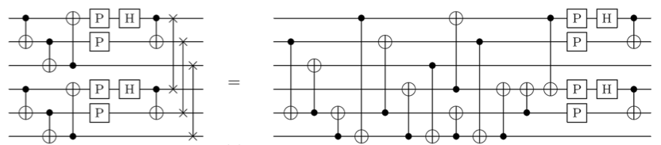

<!-- PROJECT LOGO -->
 

  

  <h3 align="center">6-Qubit Clifford Circuit Compiler</h3>

  

    This service allows a user to access a database of pre-compiled 6-qubit Clifford group elements. Access to this dataset can be used to implicitly synthesize optimal 6-qubit Clifford circuits in record time. 
  

<!-- TABLE OF CONTENTS -->

  
Table of Contents

  <ol>
    <li>
      <a href="#about-the-project">About The Project</a>
    </li>
    <li>
      <a href="#getting-started">Getting Started</a>
    </li>
    <li><a href="#usage">Usage</a></li>
    <li><a href="#license">License</a></li>
    <li><a href="#contact">Contact</a></li>
    <li><a href="#acknowledgements">Acknowledgements</a></li>
  </ol>

<!-- ABOUT THE PROJECT -->
## About The Project

This service allows a user to access a database of pre-compiled 6-qubit Clifford group elements. Access to this dataset can be used to implicitly synthesize optimal 6-qubit Clifford circuits in record time. 

The service is based on the IBM Quantum paper entitled "6-qubit Optimal Clifford Circuits" by Sergey Bravyi, Joseph A. Latone and Dmitri Maslov.

<!-- GETTING STARTED -->
## Getting Started

<!-- USAGE EXAMPLES -->
## Usage

<!-- LICENSE -->
## License

<!-- CONTACT -->
## Contact

Aggie Branczyk - agata.branczyk@ibm.com

<!-- ACKNOWLEDGEMENTS -->
## Acknowledgements

